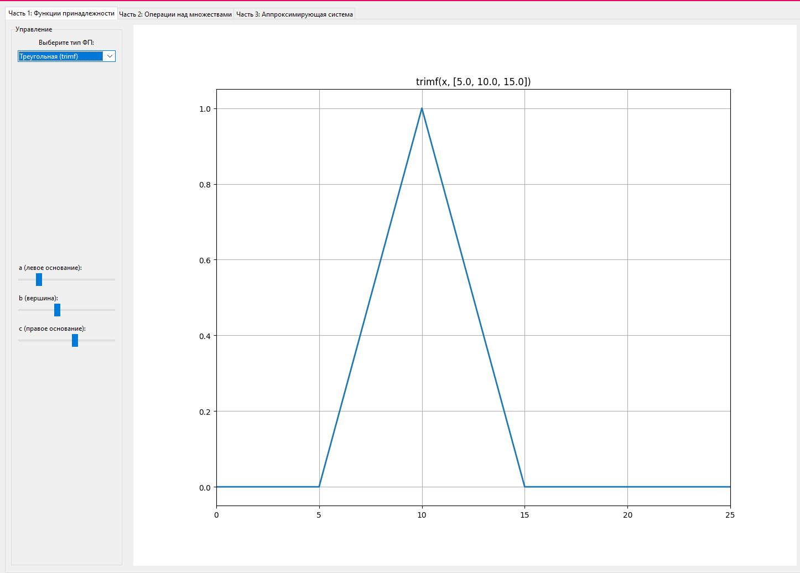
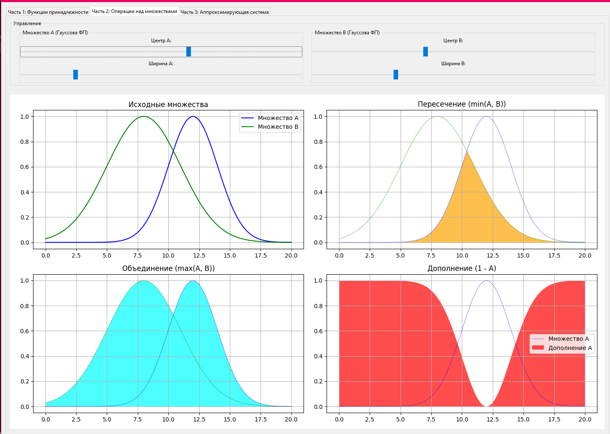

# Лабораторная работа №1: Нечёткая логика и нечёткие множества

## Отчет о выполнении работы по курсу "Системы поддержки принятия интеллектуальных решений"

### 1. Цель работы

Основная цель данной лабораторной работы заключалась в изучении фундаментальных концепций теории нечётких множеств, освоении различных видов функций принадлежности (ФП) и получении практических навыков построения нечётких аппроксимирующих систем.

В отличие от предложенного в методических указаниях инструментария MATLAB Fuzzy Logic Toolbox, данная работа была полностью реализована на языке **Python** с использованием библиотеки **scikit-fuzzy**, что является современной и гибкой альтернативой.

### 2. Технологический стек

*   **Язык программирования:** Python 3
*   **Графический интерфейс:** Tkinter (стандартная библиотека Python)
*   **Нечёткая логика:** scikit-fuzzy
*   **Математические вычисления:** NumPy
*   **Визуализация и графики:** Matplotlib

### 3. Установка и запуск

1.  **Клонируйте репозиторий:**
    ```bash
    git clone https://github.com/vadikbee/SPIIVT-LABA1.git
    cd ВАШ_РЕПОЗИТОРИЙ
    ```

2.  **Установите необходимые зависимости:**
    ```bash
    pip install numpy matplotlib scikit-fuzzy
    ```
    *Примечание: Tkinter обычно входит в стандартную поставку Python.*

3.  **Запустите приложение:**
    ```bash
    python SPIIVT-LABA1.py
    ```

### 4. Отчет о выполнении и демонстрация работы

Приложение состоит из трех вкладок, каждая из которых соответствует ключевой части лабораторной работы.

#### Часть 1: Исследование функций принадлежности (ФП)

На этой вкладке реализован интерактивный инструмент для визуализации и исследования семи основных типов функций принадлежности. Пользователь может выбрать тип функции из выпадающего списка и в реальном времени изменять её параметры с помощью ползунков. График автоматически обновляется, наглядно демонстрируя, как каждый параметр влияет на форму ФП.

**Результат:**
*   Создан удобный интерфейс для изучения ФП.
*   Реализована динамическая перерисовка графика при изменении параметров.
*   Добавлена обработка некорректных параметров (например, `a > b` для треугольной ФП) с выводом сообщения об ошибке.

<br>
  
<br>

---

#### Часть 2: Операции над нечёткими множествами

Вторая вкладка посвящена демонстрации базовых теоретико-множественных операций над нечёткими множествами:
1.  **Пересечение** (логическое И, `fmin`)
2.  **Объединение** (логическое ИЛИ, `fmax`)
3.  **Дополнение** (логическое НЕ, `1 - A`)

Для демонстрации используются два нечётких множества, заданных гауссовой функцией принадлежности. Пользователь может изменять их центр (`mean`) и ширину (`sigma`), наблюдая за изменением исходных множеств и результатов операций на четырех отдельных графиках.

**Результат:**
*   Наглядно продемонстрированы ключевые операции нечёткой логики.
*   Интерактивные элементы управления позволяют исследовать поведение операций при различных конфигурациях исходных множеств.

<br>
  
<br>

---

#### Часть 3: Построение нечёткой аппроксимирующей системы

Эта часть является ключевой и демонстрирует построение нечёткой системы вывода типа Сугэно (0-го порядка) для аппроксимации заданной функции. В качестве основы были взяты данные из **Варианта №2** методического пособия:

*   **Входные точки `x`:** `[-1, -0.6, 0.2, 0.4, 1]`
*   **Выходные значения `y`:** `[-1, -1.67, 5, 2.5, 1]`

Система была создана программно с помощью `scikit-fuzzy`:
*   **Входная переменная (`Antecedent`):** Для каждого значения `x` создана треугольная ФП (`trimf`).
*   **Выходная переменная (`Consequent`):** Для каждого значения `y` создан синглтон (треугольная ФП с нулевым основанием).
*   **База правил:** Сформированы 5 правил вида `ЕСЛИ x ЕСТЬ term_i ТО y ЕСТЬ level_i`.

На вкладке расположены:
1.  **Интерактивный симулятор:** Пользователь может перемещать ползунок для изменения входного значения `x` и видеть на графике, как активируются входные ФП. Итоговое вычисленное значение `y` отображается в текстовом поле.
2.  **График результата аппроксимации:** На этом графике показаны исходные точки и итоговая кривая, построенная нечёткой системой, которая плавно проходит через заданные узловые точки.

**Результат:**
*   Успешно спроектирована и реализована нечёткая система для аппроксимации функции.
*   Создан наглядный интерфейс для тестирования системы и демонстрации процесса нечёткого вывода.

<br>
  
<br>

> **_[ Сюда вставьте скриншот вкладки "Часть 3" с итоговым графиком аппроксимации ]_**
>
> ``

<br>

### 5. Заключение

В ходе выполнения лабораторной работы были достигнуты все поставленные цели. Разработанное на Python интерактивное приложение позволило глубоко изучить основные понятия теории нечёткой логики, от базовых функций принадлежности до построения полноценной аппроксимирующей системы. Выбранный технологический стек показал свою эффективность и гибкость для решения подобных задач.